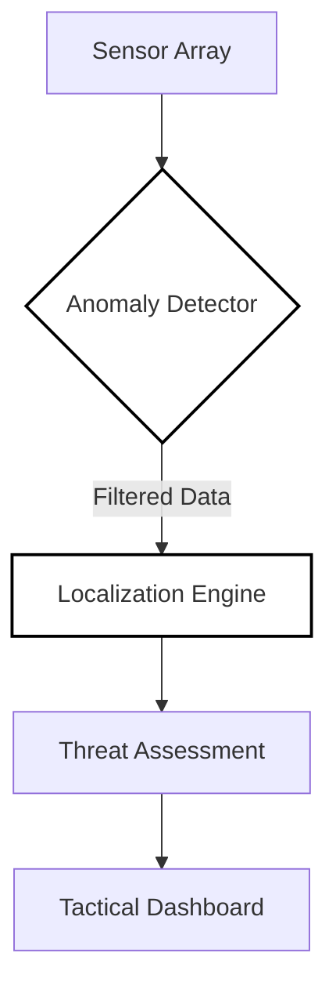

<div align="center">

# EW Threat Detection

**Military-Grade Electromagnetic Intelligence & Source Localization System**

[](https://github.com/AsaqeLee/EW-THREAT-DETECTION-SYSTEM)
[](https://github.com/AsaqeLee/EW-THREAT-DETECTION-SYSTEM)
[](https://github.com/AsaqeLee/EW-THREAT-DETECTION-SYSTEM)

English | [简体中文](./README_ZH.md)

</div>

---

## Introduction

The **EW Threat Detection System** is a distributed sensor array platform designed for high-precision localization of electromagnetic interference. Integrating Flask with real-world mapping (OpenStreetMap), the system provides a tactical interface for military-grade threat assessment, utilizing multi-algorithm fusion for robust performance in hostile environments.

>[!IMPORTANT]
>This system employs a weighted multi-algorithm engine (Least Squares, WLS, Centroid) coupled with real-time anomaly detection to eliminate compromised sensor data from tactical calculations.

---

## Tactical Architecture

The system orchestrates distributed sensor nodes through a centralized localization engine.



---

## Technical Specifications

<details>
<summary><b>Localization Engine</b></summary>

The engine fuses three primary methodologies:
1. **Weighted Least Squares (WLS):** Prioritizes high-SNR signals for precision.
2. **Standard Least Squares:** Benchmarking for stable signal environments.
3. **Centroid Localization:** Rapid approximation and robust fallback.
</details>

<details>
<summary><b>Anomaly Detection Protocol</b></summary>

Ensures the integrity of the tactical display:
- **Z-Score Detection:** Statistical identification of out-of-band power reports.
- **IQR Filtering:** Robust exclusion of non-standard interference data.
- **Distance-Based Validation:** Cross-referencing power decay against spatial coordinates.
</details>

<details>
<summary><b>Enterprise Installation & Setup</b></summary>

### Prerequisites
- Python 3.8+
- Modern Web Browser (Map rendering)

### Deployment
```bash
# Clone the tactical repository
git clone https://github.com/AsaqeLee/EW-THREAT-DETECTION-SYSTEM.git
cd EW-THREAT-DETECTION-SYSTEM

# Install intelligence dependencies
pip install -r requirements.txt

# Launch mission control
python app.py
```
</details>

---

## Strategic Boundaries

- **Real-World Integration:** Fully supports GPS coordinate systems and geo-conversion.
- **Tactical Scaling:** Designed for 100km x 100km operational theaters.
- **High Integrity:** Continuous quality scoring (Excellent to Poor) for all localized results.

---

<div align="center">

&copy; 2026 AsaqeLee. Engineered for electromagnetic superiority.

</div>
