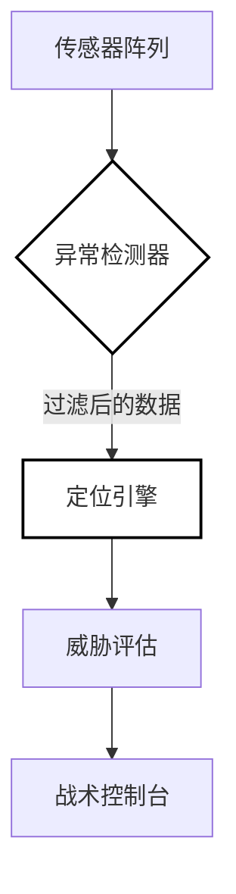

<div align="center">

# 电磁威胁感知系统

**军事级电磁干扰源情报收集与高精度定位系统**

[](https://github.com/AsaqeLee/EW-THREAT-DETECTION-SYSTEM)
[](https://github.com/AsaqeLee/EW-THREAT-DETECTION-SYSTEM)
[](https://github.com/AsaqeLee/EW-THREAT-DETECTION-SYSTEM)

[English](./README.md) | 简体中文

</div>

---

## 项目简介

**EW Threat Detection System** 是一个基于分布式传感器阵列的电磁干扰源定位平台。该系统集成了 Flask 后端与真实地图环境 (OpenStreetMap)，为军事级威胁评估提供了战术界面。通过多算法融合技术，系统能够在复杂的电磁环境下实现鲁棒的定位性能。

>[!IMPORTANT]
>本系统采用了加权多算法引擎（最小二乘法、WLS、质心法），结合实时异常检测协议，能够有效从战术计算中剔除受损传感器的错误数据。

---

## 战术架构

系统通过中央定位引擎编排分布式传感器节点。



---

## 技术规格

<details>
<summary><b>定位引擎算法库</b></summary>

引擎融合了三种核心定位方法：
1. **加权最小二乘法 (WLS):** 优先处理高信噪比 (SNR) 信号以提升精度。
2. **标准最小二乘法:** 稳定信号环境下的基准算法。
3. **质心定位法:** 快速近似计算与鲁棒的备选方案。
</details>

<details>
<summary><b>异常检测协议 (Anomaly Detection)</b></summary>

确保战术显示的完整性：
- **Z-Score 检测:** 统计学识别超出正常范围的功率报告。
- **IQR 过滤:** 基于四分位距鲁棒地排除非标干扰数据。
- **基于距离的验证:** 交叉引用功率衰减曲线与空间坐标的匹配度。
</details>

<details>
<summary><b>企业级安装与部署</b></summary>

### 前置要求
- Python 3.8 或更高版本
- 现代 Web 浏览器（用于地图渲染）

### 部署指令
```bash
# 克隆战术仓库
git clone https://github.com/AsaqeLee/EW-THREAT-DETECTION-SYSTEM.git
cd EW-THREAT-DETECTION-SYSTEM

# 安装相关依赖
pip install -r requirements.txt

# 启动任务中心
python app.py
```
</details>

---

## 战略能力

- **实战地理集成:** 全面支持 GPS 坐标系统与地理坐标转换。
- **战术缩放:** 专为 100km x 100km 战术区域监控设计。
- **高完整性:** 为所有定位结果提供持续的质量评分（从 Excellent 到 Poor）。

---

<div align="center">

&copy; 2026 AsaqeLee. 为电磁优势而设计。

</div>
